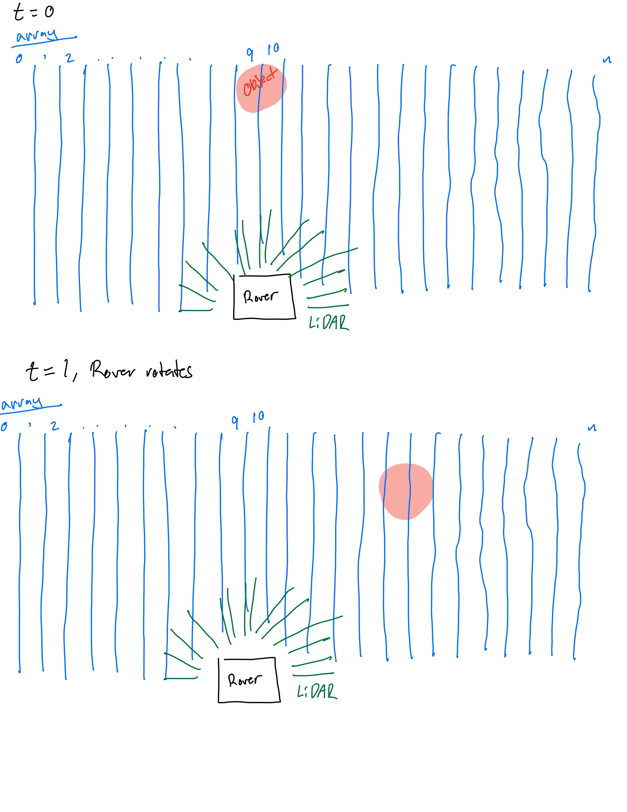

## Where I am coming from
When I have made a world representation previously, I used a discrete 2d array that spanned the entire operating environment where each element represented a grid square of the environment. The robot moved through its environment with some x,y location with effectively exact precision. When its lidar sensor detected a surface, the xy coordinate (reltaive to the environment) of this measurement was calculated using the location of the robot and the angle and distance to the surface. This was done many many times a second. With many many points, a birds eye view of the environment would start take shape. 

During this, there was a small chance for erroneus measurements from the lidar sensor. To account for this, a grid square in the environment would only be considered to be occupied (by an obstacle) after having some amount of measurements detected within its bounds. 

## What to do for our rover

I imagine that we have some sort of simple 'world representaion' that is just a 1D array that has a 1 where there is an obstacle and zero where there is not. An obstacle would determined to be in that bin if there were some number of measeurements that placed an obstacle there in the past x amount of time. With this though, I don't know how to account for rotation. Maybe we assume we don't rotate?  

I toyed with the idea of having a 1d array that would be 1 if it was determined if there was an obstacle there, but once the rover turns, this map would make no sense. I was imagining something like:

Somehow we would have to keep track of the object rotating... 

Maybe we could only look at the past 3 seconds of data from the lidar to determine if there was an obstacle in one of these vertical bins as seen in the image above. The only issue is that when the rover is rotating, the object may appear as a streak or may not appear at all depending on the threshold we determine for detections to count as an obstacle. 

```python
def updateObstacleArr(arr: ArrayLike, dim: float, measurements: List[float]):
    #inputs:
    #   arr: a 1d numpy boolean array that will indicate whether there is an obstacle at some location or not
    #   x_dim: length [m] that array represents in the horizontal direction
    #   measurements: list of measurements returned by the lidar sensor
    # returns:
    #   updated obstacle array

    # origin 

```